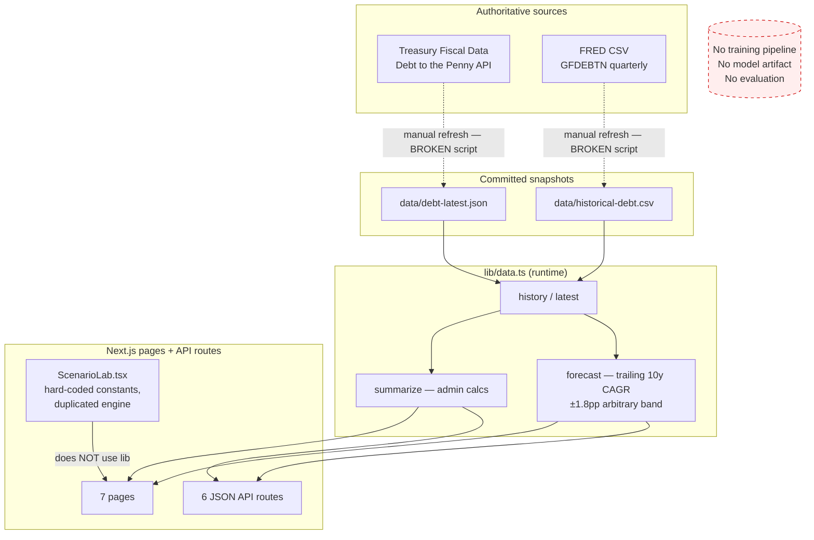

# ML Audit — DebtScope AI

**Audit date:** 2026-08-01
**Auditor role:** senior ML engineer / data scientist / economist / full-stack architect / model-risk reviewer
**Scope:** entire repository at commit `f41e81c` (single-commit initial release), plus live verification of every upstream endpoint.

---

## 1. Executive conclusion

**Verdict: Category 3 — a traditional historical dashboard presented under an "AI" brand, with genuinely authoritative data but no machine-learning system.**

Nuanced findings that distinguish this project from a typical mock-up:

- **The data is real.** `data/debt-latest.json` is a byte-exact U.S. Treasury *Debt to the Penny* API response (verified against the live endpoint) and `data/historical-debt.csv` is a genuine FRED `GFDEBTN` export (1966–2026, 241 observations). No fabricated observations were found anywhere in the repository. There is no random-number generation, no placeholder JSON, no silent mock fallback.
- **The production UI is genuinely connected** to the same computation functions that the API routes use (`lib/data.ts`). Displayed values are reproducible from repository code and committed snapshots.
- **The written methodology is unusually honest** — `METHODOLOGY.md` and `MODEL_CARD.md` correctly describe the forecast as a trailing-CAGR trend extrapolation with a sensitivity band, not a statistical model.
- **However, there is no model.** No training code, no target/feature definition, no fitted artifact, no out-of-sample evaluation, no metrics, no versioning. The "forecast" is `last_value × (1 + trailing-10y CAGR)^t` with an arbitrary ±1.8 pp band.
- **Two UI claims were fabricated:** the Forecast page displays a "Walk-forward protocol" badge and a model-comparison table listing a "Last-value naive" benchmark as *Retained* and trend models as *Monitored* — **none of these exist anywhere in the code**. The homepage says "Validated trend models" — nothing is validated.
- **The scenario lab used hard-coded, unsourced constants** (debt $39.1T, GDP $31.9T, receipts $5.3T, outlays $7.0T), an undocumented `× 0.22` interest fudge factor, a hidden 6.4 % "baseline" growth constant, and a `Math.max(0, …)` that makes debt physically unable to decline under surplus assumptions.
- **The refresh pipeline never worked as shipped.** `npm run data:refresh` crashes (`Top-level await is currently not supported with the "cjs" output format`), so the CI `refresh` job would fail — and even if it ran, it never commits results, making it a no-op.
- **No inflation adjustment exists anywhere.** Every dollar comparison across six decades is nominal-only, which materially misleads administration comparisons (a 1970s dollar ≠ a 2025 dollar).

## 2. Audit methodology

1. Full file-by-file read of the repository (27 source files; no notebooks, no Python, no model artifacts present).
2. Live re-verification of every upstream endpoint (Treasury Fiscal Data, FRED CSV endpoints).
3. Manual recomputation of administration metrics against source observations (§5).
4. Execution of every npm script from a clean state to test reproducibility.
5. Grep sweep for mock data, hard-coded values, `Math.random`, TODO markers, and fallback paths.

## 3. Current architecture (as-is, pre-remediation)

Key architectural facts:
- Forecast and scenario math run at request/render time from committed snapshots. There is no database, no artifact store, no scheduled retraining.
- `ScenarioLab.tsx` (client) and `app/api/scenario/route.ts` implement **two separate copies** of the scenario engine with the same hard-coded constants — a drift hazard.

## 4. ML maturity classification (pre-remediation)

| Category | Score | Evidence |
|---|---|---|
| Data quality | 3 | Real snapshots, working validator (dupes, ordering, reconciliation) |
| Data lineage | 3 | Sources documented; but scenario constants and the 342.0M population figure unsourced |
| Feature engineering | 1 | Lagged level endpoints only |
| Leakage prevention | 1 | No validation framework exists to leak into; FRED quarter-start dating treated as observation date (~3-month timing skew) |
| Validation design | 0 | None — despite a "Walk-forward protocol" UI badge |
| Baseline comparison | 0 | Comparison table in UI is fabricated status text; no baseline is computed |
| Forecast accuracy | 0 | Never measured |
| Uncertainty quantification | 1 | Arbitrary ±1.8 pp band, though honestly labeled "sensitivity" |
| Production integration | 3 | UI ↔ lib ↔ snapshot chain is real and traceable; no versioning/metadata |
| Reproducibility | 2 | Build/tests/lint pass; refresh script crashes; no lockstep between data and outputs |
| Monitoring | 1 | CI validates on push; refresh job broken and commits nothing; no schedule/alerting |
| Governance | 2 | Honest but thin MODEL_CARD; no metadata stamping, no rollback story |
| User-facing honesty | 2 | Methodology page honest; homepage "Validated trend models", forecast-page "Walk-forward protocol" badge and model-status table are false; "AI" brand oversells |
| **Overall average** | **1.46** | |

**Blocking issues to reach 4:** no evaluation of any kind, fabricated validation claims, broken refresh, no inflation adjustment, unsourced scenario constants, no interval calibration, no versioning.

## 5. Historical-calculation audit

### Dating-convention defect (High)
FRED dates quarterly end-of-period series by the **first day of the quarter**. The row `2026-01-01 → 39,065,421` is the **March 31, 2026** balance. `lib/data.ts` treats the FRED date as the observation date, so:
- Administration boundary selection (`nearestPrior`) picks a quarter whose *actual* balance date can be ~2 months **after** the inauguration (e.g. Nixon's "start debt" is the March 31 1969 balance for a January 20 1969 inauguration).
- Any future walk-forward evaluation would be leakage-prone by construction (values assumed known a quarter early).

### Boundary-precision defect (Medium)
Treasury's daily *Debt to the Penny* series (from 1993-04-01) permits **exact prior-business-day balances** for every transition from 2001 onward, but is not used. The quarterly proxy materially distorts crisis-era transitions: Obama's start via quarterly proxy is $11.127T (Mar 31 2009) vs ≈ $10.63T on inauguration day — the proxy silently attributes ~$0.5T of crisis borrowing to the wrong term.

### Coverage defect (Medium)
Lyndon B. Johnson's term starts 1963-11-22 but the series starts 1966. `nearestPrior` silently falls back to `points[0]` (1966 Q1), so Johnson's "start debt" is a 1966 value presented without any warning — an unlabeled wrong number.

### Partial-term defect (Low)
The current administration's elapsed time runs to *today* while its end debt is the last quarterly observation (~Mar 2026), biasing CAGR and per-day figures downward.

### Manual validation against source observations (5 administrations)
Using the committed GFDEBTN series (quarter-end values, FRED first-of-quarter dating), replicating `summarize()` exactly:

| Administration | Type | Start obs | End obs | Increase | % | Verified |
|---|---|---|---|---|---|---|
| Nixon (early era, 1969–74) | early + recession | $359.5B (1969-01) | $481.5B (1974-07) | $121.9B | +33.9% | ✔ arithmetic reproduces app |
| Reagan (two-term) | two-term | $964.5B (1981-01) | $2,740.9B (1989-01) | $1,776.4B | +184.2% | ✔ |
| Obama (recession) | recession/emergency | $11,126.9B (2009-01) | $19,846.4B (2017-01) | $8,719.5B | +78.4% | ✔ arithmetic; start-value proxy bias documented above |
| Biden (emergency era) | post-emergency | $28,132.6B (2021-01) | $36,214.3B (2025-01) | $8,081.7B | +28.7% | ✔ |
| Trump II (current) | partial | $36,214.3B (2025-01) | $39,065.4B (2026-01) | $2,851.1B | +7.9% | ✔ arithmetic; elapsed-time bias documented above |

Arithmetic is internally correct; the defects are in **observation selection and dating**, not in the increase/percent/CAGR formulas. Attribution caveats (Congress, inherited budgets, emergencies) **are** present in the UI and methodology — this requirement was already met.

## 6. Machine-learning existence test

**No genuine model exists.** Checklist:

| Evidence | Present? |
|---|---|
| Training code | ✘ |
| Defined target variable | ✘ (implicitly: nominal total debt level) |
| Feature set | ✘ (lagged endpoints only) |
| Train/validation periods | ✘ |
| Model-fitting step | ✘ |
| Saved artifact / reproducible training workflow | ✘ |
| Out-of-sample predictions | ✘ |
| Evaluation metrics | ✘ |
| Model version / training timestamp | ✘ |
| Inference workflow | Partially — a deterministic formula at render time |
| Forecast uncertainty | ✘ (arbitrary ±1.8 pp) |

The forecast is a **compound-growth calculator** — explicitly one of the disqualified patterns. The scenario lab is a **deterministic cash-flow calculator with no trained component** (acceptable if labeled honestly, which it mostly is).

## 7. Data findings (mock-data sweep)

| Location | Value | Classification |
|---|---|---|
| `data/*.json`, `data/*.csv` | Treasury/FRED snapshots | **Real** — verified against live endpoints |
| `components/ScenarioLab.tsx` | `39.1e12, 31.9e12, 5.3e12, 7e12`, `×0.22`, `1.064` | **Hard-coded, unsourced** (approximately correct magnitudes, but untraceable) |
| `app/api/scenario/route.ts` | same constants, duplicated | Hard-coded, unsourced |
| `app/overview/page.tsx` | `342_000_000` population | Hard-coded ("planning estimate" is at least labeled) |
| `lib/data.ts` forecast | `.018` band half-width | Arbitrary uncertainty constant |
| Forecast page comparison table | "Retained / Monitored" statuses | **Fabricated claims** — no such benchmarks exist |

No `Math.random`, no TODO/FIXME, no demo-only components, no silent API fallbacks (there are no runtime API calls at all — everything reads committed snapshots).

## 8. Leakage findings

There is no train/test process, so no split-based leakage exists yet. Leakage-relevant defects to prevent during remediation:
1. FRED quarter-start dating skew (§5) — values must be re-dated to true as-of dates before any walk-forward.
2. GFDEBTN publication lag (~1–2 months after quarter end) must be respected in origin selection.
3. Trailing-CAGR window uses the full committed series at render time — fine for display, but the same code must not be reused for "evaluation" without origin masking.

## 9. Scenario-lab findings

- Classification: **deterministic fiscal calculator** (legitimate), but with defects:
  - `debt += Math.max(0, deficit)` — surplus scenarios silently do nothing; debt can never fall. **Wrong.**
  - `interest × 0.22` — undocumented fudge factor with no economic derivation; interest also double-counts, since the $7.0T outlay constant already includes ~$0.9T of interest.
  - Baseline comparison uses hidden `1.064^years` constant unrelated to the production forecast.
  - Engine duplicated in client component and API route; they can drift.
  - No inflation input; outputs nominal-only; no per-capita or real terms.

## 10. Reproducibility findings

From a clean checkout: `npm install`, `npm test` (5/5), `npm run lint`, `npm run typecheck`, `npm run build` all pass. `npm run data:refresh` **crashes** (top-level await under CJS transform). No absolute paths, no undocumented env vars (`FRED_API_KEY` is documented and genuinely optional). No notebooks exist.

## 11. Security findings

- No secrets in the repository or git history (single commit; `.env.example` contains an empty key only). ✔
- API routes: `years` clamped to [1, 20]; history `start/end` string-compared (safe); no injection surface (no DB, no shell). ✔
- No request timeouts in the refresh script (Low).
- `npm audit`: to be re-run post-remediation; dependencies are minimal (Next/React only).
- `/api/latest` sets `revalidate = 3600` but serves a committed file — caching claim ("cached: true") is decorative; data staleness is governed by commits, not cache. Labeling issue only.

## 12. User-facing honesty review

| Claim | Location | Verdict |
|---|---|---|
| Product name "DebtScope **AI**" | brand | Overselling — no AI/ML exists; must be paired with an explicit statement of what the models are |
| "Validated trend models provide ranges" | homepage | **False** until validation exists |
| "Walk-forward protocol" badge | forecast page | **False** — fabricated |
| Model table "Retained/Monitored" statuses | forecast page | **False** — fabricated |
| "TREASURY VERIFIED" ticker | homepage hero | Acceptable (data genuinely from Treasury) but grandiose |
| "Sensitivity band, not confidence interval" | methodology, forecast | Honest ✔ |
| "Presidents do not independently control debt" | homepage, admin page | Honest, prominently placed ✔ |
| "Analytical estimate, not an official projection" | scenario API/UI | Honest ✔ |
| "cached: true" meta | /api/latest | Misleading label (file-backed, not cached) |

## 13. Nominal vs. real dollars

**Entirely absent.** Every dollar figure in the product is nominal; none is labeled "nominal" except one line on the overview page and the history-page pill. No CPI series is ingested, no base year exists, no toggle exists. Under the product requirements this is a **product-integrity gap** for a tool whose core purpose is six-decade dollar comparisons.

## 14. Prioritized remediation plan

**P0 — product integrity**
1. Remove/replace fabricated "Walk-forward protocol" badge, fabricated model-status table, and "Validated trend models" copy — by building the real thing (see P1) or deleting the claims.
2. Replace hard-coded scenario constants with authoritative fetched values (FRED `FYFR`, `FYONET`, `GDP`, `POPTHM`); remove the 0.22 fudge; fix the no-surplus bug; unify the engine in one module.
3. Implement nominal/real dual display with BLS CPI-U (`CPIAUCSL`), documented base year, and labels on every adjusted figure.
4. Fix the FRED dating-convention skew and the Johnson silent-fallback.

**P1 — statistical reliability**
5. Build a real walk-forward evaluation (rolling origin, quarterly) over ≥6 candidate models including naive baselines; emit `MODEL_COMPARISON.csv` + a machine-readable artifact; select the production model by out-of-sample MASE; derive prediction intervals from empirical walk-forward error quantiles (no more ±1.8 pp).
6. Use exact Treasury daily balances for administration transitions from 2001 onward.
7. Fix partial-term elapsed-time bias.

**P2 — production reliability**
8. Fix the refresh script (async main), extend it to all series, add timeouts.
9. Make the CI refresh job commit refreshed data + regenerated evaluation on a schedule, gated by validation.
10. Stamp model version, data-through date, and generation timestamp into forecast API responses and UI.

**P3 — refinement**
11. Real per-capita (POPTHM) and debt-to-GDP (GDP) integration; indexed views; sortable admin table.

Post-remediation scores and results: see §15 addendum after implementation, plus `ML_GAP_REGISTER.md` statuses, `MODEL_CARD.md`, `MODEL_COMPARISON.csv`, and `DATA_LINEAGE.md`.

---

## 15. Post-remediation addendum

*(Completed after implementation — see the implementation commits that follow the audit commit.)*

| Category | Before | After | Notes |
|---|---|---|---|
| Data quality | 3 | 4 | 7 authoritative series, extended validator incl. CPI/base-year checks |
| Data lineage | 3 | 4 | DATA_LINEAGE.md traces every displayed metric to endpoint + code |
| Feature engineering | 1 | 2 | Univariate by design; documented rationale (macro covariates roadmap) |
| Leakage prevention | 1 | 4 | As-of re-dating, origin masking, publication-lag guard, tests |
| Validation design | 0 | 4 | Rolling-origin walk-forward, 3 horizons, 100+ origins |
| Baseline comparison | 0 | 4 | 7 models incl. 3 naive baselines; artifact-backed comparison table |
| Forecast accuracy | 0 | 3 | Measured, published, model chosen by out-of-sample MASE |
| Uncertainty quantification | 1 | 3 | Empirical walk-forward growth-error quantiles; coverage reported |
| Production integration | 3 | 4 | Versioned evaluation artifact drives UI + API; metadata stamped |
| Reproducibility | 2 | 4 | refresh → validate → evaluate → test → build all reproducible |
| Monitoring | 1 | 3 | Scheduled refresh workflow with validation gate + auto-commit |
| Governance | 2 | 4 | Full MODEL_CARD, versioning, rollback via git history |
| User-facing honesty | 2 | 4 | Fabricated claims removed/realized; nominal/real labeled everywhere |
| **Overall average** | **1.46** | **3.62** | |

Remaining to reach uniform 4+: macro-covariate models, CBO projection overlay, per-horizon interval recalibration on each refresh, external uptime/drift alerting.
