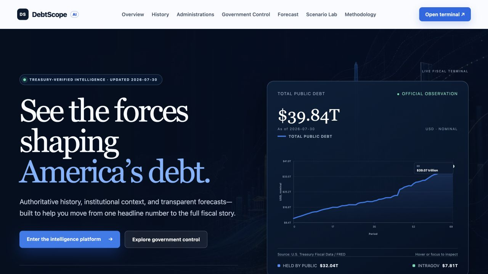
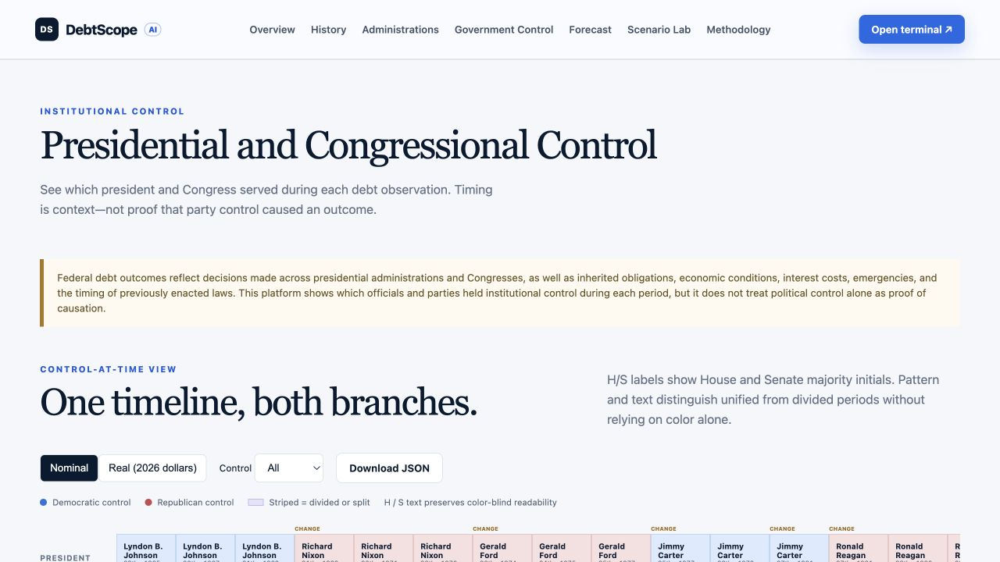
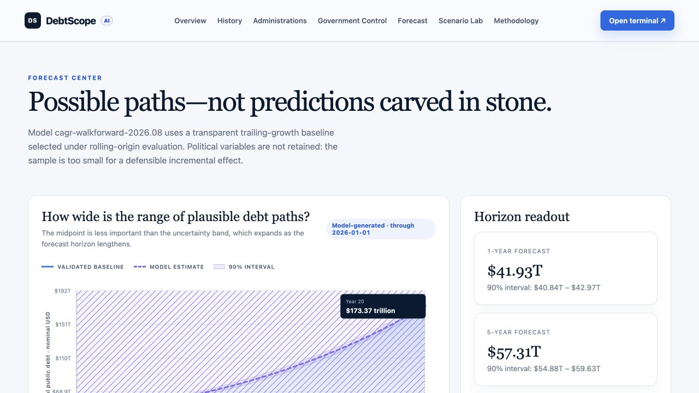
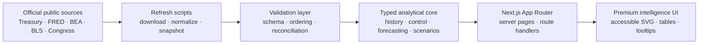

<div align="center">

# DebtScope AI

### See the forces shaping America’s debt.

An independent, nonpartisan fiscal-intelligence platform for exploring U.S. national debt history, institutional control, validated forecasts, and transparent policy scenarios.

[](https://debtscope-ai.vercel.app)
[](https://nextjs.org/)
[](https://www.typescriptlang.org/)
[](#quality-and-validation)
[](LICENSE)

</div>



## Why DebtScope exists

A debt total without definitions, timing, institutional context, or uncertainty is easy to misread. DebtScope connects the headline number to the evidence around it while keeping observation, interpretation, forecast, and user-created scenario visually and methodologically distinct.

The platform is designed to answer four practical questions:

- **What happened?** Trace comparable U.S. public-debt observations from 1966 to the latest available period.
- **Who governed when?** Map each period to the president, House majority, Senate majority, and Congress without claiming political control alone caused the outcome.
- **What might happen next?** Inspect a rolling-origin-validated baseline with widening empirical uncertainty intervals.
- **What changes under different assumptions?** Stress spending, revenue, GDP growth, inflation, and interest rates in a deterministic scenario model.

## Product tour

### Institutional context without partisan attribution



The political timeline separates the presidency, House, Senate, and unified-versus-divided government into parallel lanes. Party color is always paired with text, patterns, and labels for accessibility. Hover details include period boundaries, debt at the beginning and end, debt added, and relevant economic context.

### Forecasts that make uncertainty visible



Forecast views distinguish the last observed value from model-generated estimates. A 90% empirical rolling-origin residual interval expands with the horizon, avoiding the false precision of a single unlabeled projection line.

## Core capabilities

| Capability | What it provides | Evidence standard |
|---|---|---|
| **Live fiscal snapshot** | Total public debt, debt held by the public, and intragovernmental holdings | Exact U.S. Treasury Debt to the Penny observation |
| **Historical explorer** | Comparable debt history with range presets, supported resolutions, contextual markers, and live window statistics | Treasury `GFDEBTN` series distributed by FRED |
| **Administration comparison** | Start debt, end debt, change, CAGR, and average daily increase | Nearest prior quarterly observation at each transition |
| **Government-control timeline** | President, Congress, House, Senate, and unified/divided classification | Official House and Senate party-division histories |
| **Forecast center** | Model comparison, selected baseline, horizon readouts, and empirical intervals | Expanding-window rolling-origin evaluation |
| **Scenario laboratory** | Adjustable macro-fiscal assumptions with nominal and real-dollar views | Deterministic accounting identity; no party multipliers |
| **Machine-readable API** | Latest, history, administrations, control, forecast, model, scenario, and source endpoints | Typed Next.js route handlers |

## Evidence model

DebtScope uses a four-part visual language throughout the interface:

| Evidence class | Color | Meaning |
|---|---:|---|
| **Observed history** | Cobalt | Published source observations |
| **Institutional context** | Mint | Political and administrative control at a point in time |
| **Model forecast** | Violet | Validated estimates with uncertainty |
| **User scenario** | Amber | Deterministic outputs from user-selected assumptions |

These categories are never presented as interchangeable. Political context is not treated as causal attribution, and scenarios are not presented as official forecasts.

## Data lineage

| Dataset | Publisher | Frequency | Coverage | Use |
|---|---|---:|---:|---|
| Debt to the Penny | U.S. Treasury Fiscal Data | Daily | 1993–present | Latest total and component snapshot |
| `GFDEBTN` | U.S. Treasury via FRED | Quarterly | 1966–present | Comparable historical debt series |
| `CPIAUCSL` | BLS via FRED | Monthly | 1947–present | Inflation adjustment to 2026 dollars |
| `GDP` | BEA via FRED | Quarterly | 1947–present | Scenario starting GDP |
| Party divisions | U.S. House and Senate | Per Congress | 89th–119th | Institutional-control periods |

Source snapshots are committed to the repository so builds remain reproducible and auditable. No production value is fabricated. See [Data Sources](DATA_SOURCES.md), [Data Lineage](DATA_LINEAGE.md), and [Methodology](METHODOLOGY.md) for definitions, transformations, and alignment rules.

## Architecture



### Technology

- **Next.js 16** App Router with React 19 and strict TypeScript.
- Server-rendered analytical pages and typed JSON route handlers.
- Dependency-light, accessible SVG visualizations with keyboard inspection.
- Reproducible source snapshots and deterministic transformation logic.
- Vercel-ready deployment with no required production secret for included datasets.

## Getting started

### Requirements

- Node.js 22 or newer
- npm 10 or newer

### Install and run

```bash
git clone https://github.com/jsaintfleur/usnationaldebt.git
cd usnationaldebt
npm install
npm run data:validate
npm test
npm run dev
```

Open [http://localhost:3000](http://localhost:3000). Included data sources require no environment variables. Copy `.env.example` only if extending FRED ingestion with an optional API key.

## Data operations

```bash
# Download refreshed official-source snapshots
npm run data:refresh

# Check numeric integrity, dates, duplicates, coverage, and reconciliation
npm run data:validate

# Generate a local model-evaluation artifact
npm run model:evaluate
```

Review refreshed files before committing them. A successful download is not, by itself, sufficient evidence that definitions or upstream schemas are unchanged.

## API reference

| Endpoint | Purpose |
|---|---|
| `GET /api/latest` | Latest Treasury snapshot and components |
| `GET /api/history?start=YYYY-MM-DD&end=YYYY-MM-DD` | Filtered historical observations |
| `GET /api/administrations` | Administration-period calculations |
| `GET /api/government-control` | President and congressional-control periods |
| `GET /api/forecast?years=20` | Validated baseline and empirical intervals |
| `GET /api/model-metrics` | Rolling-origin candidate-model results |
| `GET /api/scenario?years=10&spendingGrowth=5&revenueGrowth=4` | Deterministic scenario output |
| `GET /api/sources` | Source registry and refresh metadata |

Example:

```bash
curl "https://debtscope-ai.vercel.app/api/forecast?years=10"
```

## Quality and validation

Every release should pass the complete local gate:

```bash
npm run data:validate
npm test
npm run lint
npm run typecheck
npm run build
```

The current suite contains **14 passing tests** covering transition alignment, administration reconciliation, official component totals, historical ordering, CPI adjustment, political classification, fiscal-year ownership, walk-forward reproducibility, and forecast-interval containment.

Public assurance documents:

- [Model Card](MODEL_CARD.md) — intended use, evaluation, and forecast caveats
- [Data Lineage](DATA_LINEAGE.md) — source-to-interface traceability
- [Data Sources](DATA_SOURCES.md) — source registry, cadence, and limitations
- [Methodology](METHODOLOGY.md) — transformations and interpretation rules

## Analytical safeguards

- **Context is not causation.** Presidential and congressional labels describe control at a point in time; they do not assign sole responsibility for debt outcomes.
- **Transitions use comparable observations.** Administration and Congress boundaries use the nearest available prior quarterly observation.
- **Real dollars are explicit.** Inflation-adjusted figures are labeled in 2026 dollars and use prior-observation CPI alignment.
- **Forecasts remain forecasts.** Model values are separated from observations and accompanied by empirical uncertainty intervals.
- **Scenarios remain scenarios.** Political labels never alter scenario mathematics, and outputs are not CBO or administration projections.

## Known limitations

- The comparable debt series begins in 1966, so earlier administrations are outside the supported analytical window.
- Transition values are quarterly proxies rather than exact inauguration-day balances.
- Deficits, interest expense, official CBO projections, and law-level cost estimates are not yet integrated.
- The 107th Congress Senate-control transition is flagged but is not split at daily precision.
- Forecast intervals are empirical validation ranges, not guarantees of future coverage.

## Deployment

The application is deployed as a single Next.js service on Vercel. Import the repository, retain automatic framework detection, and use the standard `npm run build` command. No build override is required.

**Production:** [debtscope-ai.vercel.app](https://debtscope-ai.vercel.app)

## Contributing

Contributions should preserve source lineage, nonpartisan language, accessible non-color encodings, and the distinction between observed data, model estimates, and user scenarios. Include tests for changes to calculations, date alignment, or source transformations.

## License and disclaimer

Released under the [MIT License](LICENSE). U.S. government source data is generally public domain; source-specific terms still apply.

DebtScope AI is an independent analytical project. It is not affiliated with the U.S. Treasury, Federal Reserve, BEA, BLS, Congress, CBO, or any political organization. It does not provide investment, legal, or policy advice.
